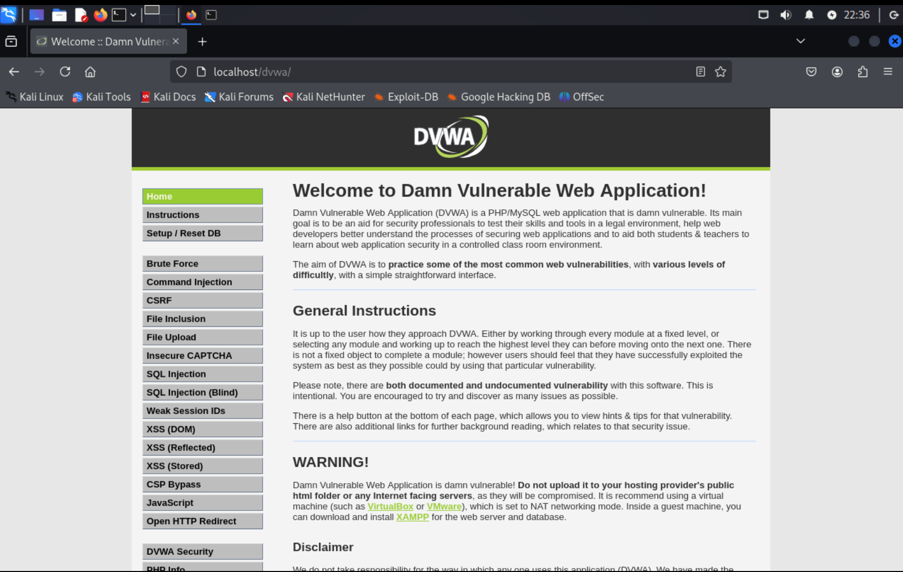
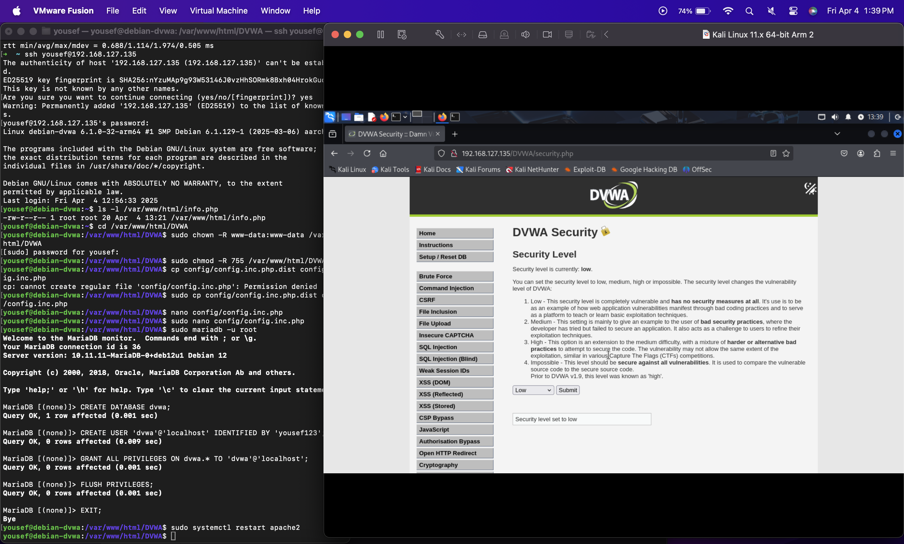
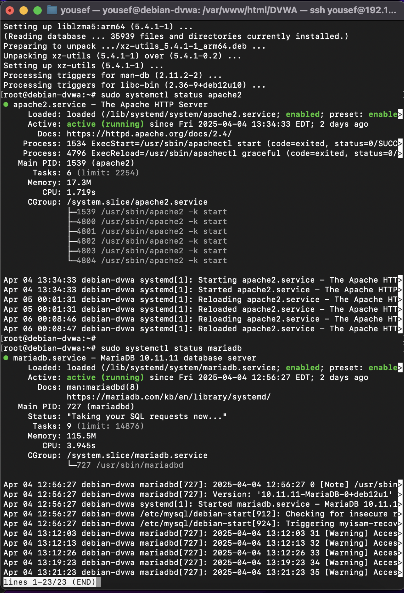
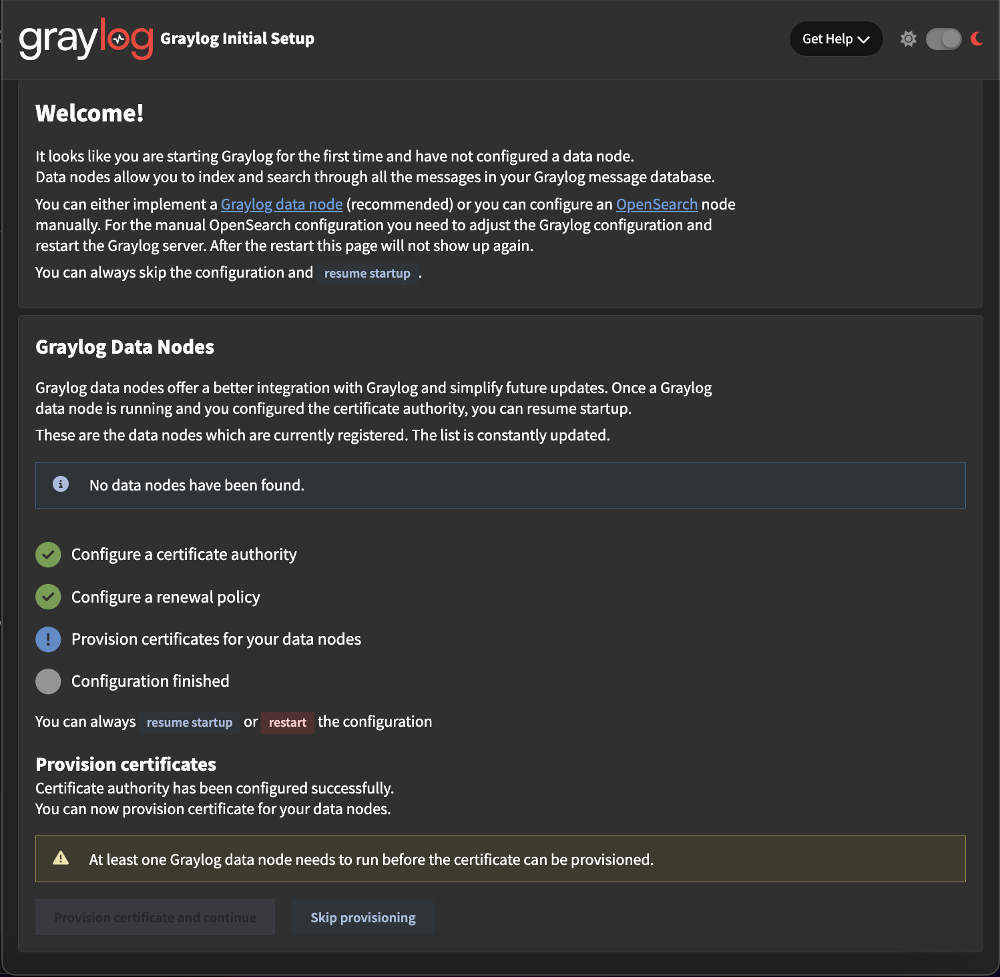
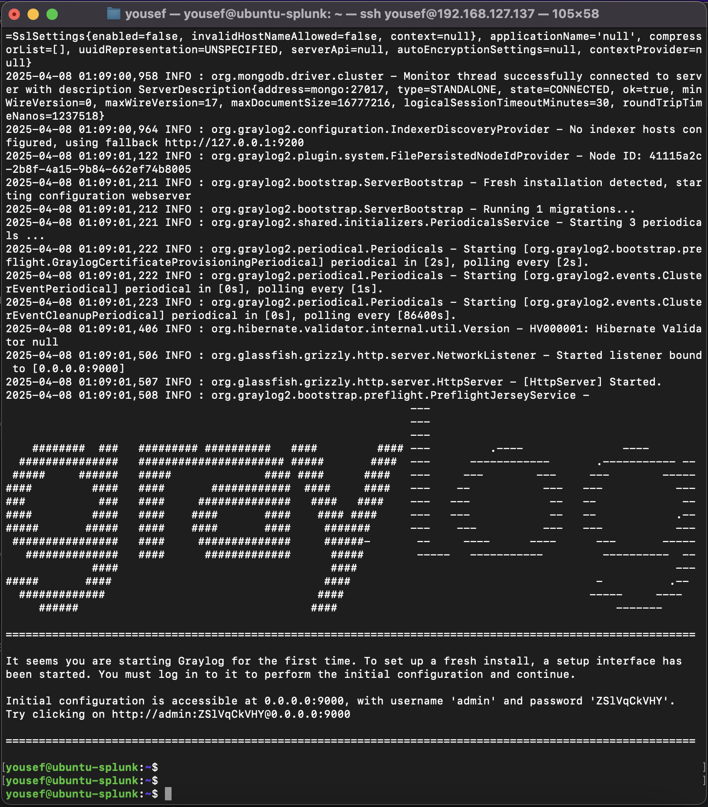
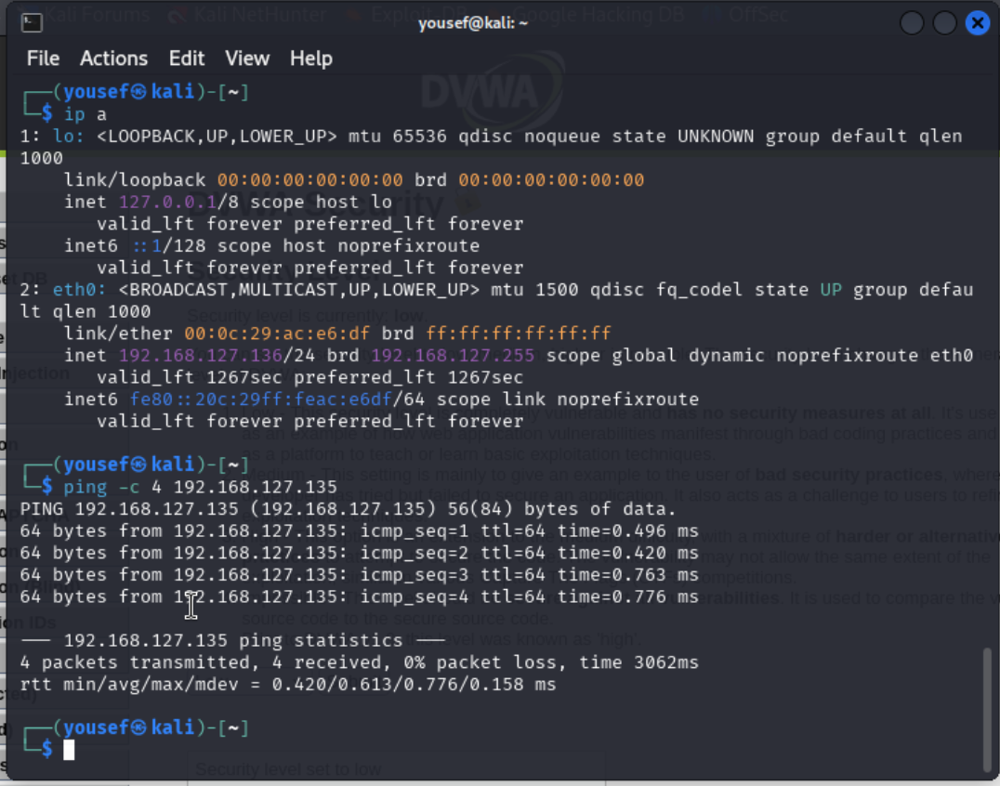
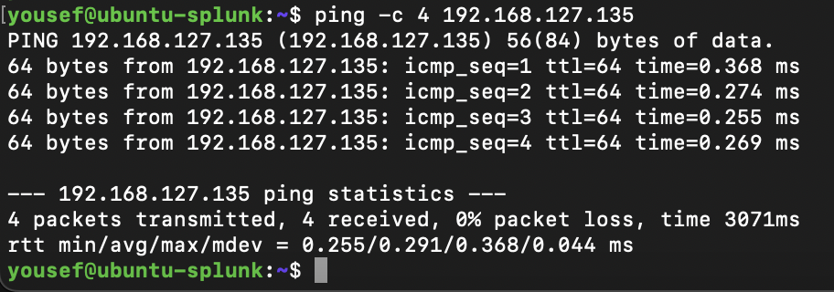
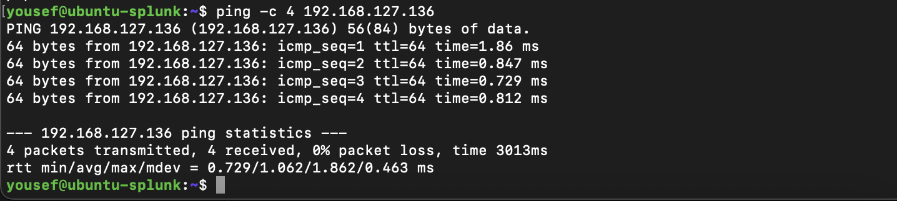
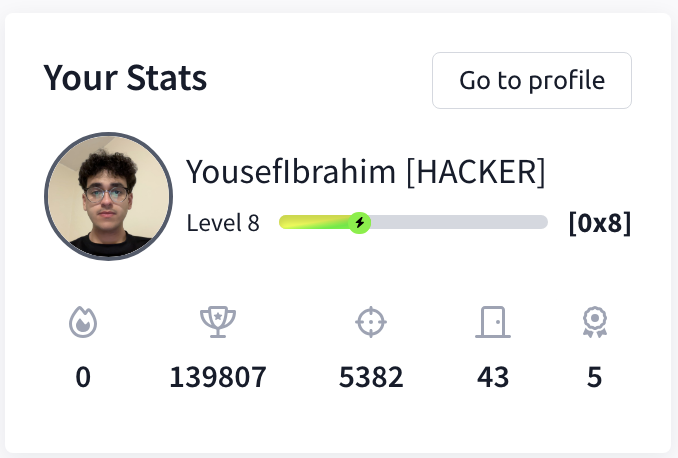

# 🛡️ Cybersecurity Homelab  
#### By Yousef Ibrahim

This homelab is a virtualized network for practicing offensive and defensive cybersecurity techniques. It's built with multiple VMs, including a vulnerable web app, logging tools, and attacker environments — all designed to simulate real-world attack surfaces and monitoring workflows.

---

## 🖥️ Lab Architecture

- **Attacker Machine:** Kali Linux (Tools: Metasploit, Nmap, Burp Suite, John the Ripper)
- **Target Machine:** Metasploitable2 (vulnerable Linux image)
- **Web App:** DVWA (Damn Vulnerable Web App) on Debian
- **Logging/Monitoring:** Graylog stack with OpenSearch, MongoDB, and GELF input

---

## 🧰 Tools and Services

| Tool               | Purpose                                 |
|--------------------|-----------------------------------------|
| **Kali Linux**      | Penetration testing + offensive tools   |
| **Metasploitable**  | Vulnerable target for exploitation      |
| **DVWA**            | Web app to test web-based attacks       |
| **Graylog**         | Centralized log collection & monitoring |
| **Apache2/MariaDB** | DVWA backend stack                      |
| **Docker Compose**  | For managing Graylog stack              |

---

## 🌐 Network Diagram

📌 Network Map  

---

## 🖥️ DVWA (Damn Vulnerable Web App)

📷 UI Preview  
  

🛠 Apache & MariaDB Status  

---

## 📊 Graylog Stack

📷 Graylog GUI Setup  

📟 Graylog CLI Output  

🐳 Docker Container Status  

---

## 📡 VM Connectivity Tests

🔁 Kali → Debian  

🔁 Ubuntu → Debian  

🔁 Ubuntu → Kali  

---

## 🧠 What I'm Learning
- Network enumeration, scanning, and web exploitation

- Configuring and securing logging pipelines

- Vulnerability assessment using Metasploit and manual tools

- Real-time event logging with Graylog and GELF inputs

## 🧠 TryHackMe Progress

I've been actively building hands-on experience through TryHackMe by completing labs focused on real-world cybersecurity scenarios.

### 📈 Stats Snapshot

### 🧪 Notable Modules & Rooms Completed
- **Cyber Defense Frameworks**
- **Cryptography**
- **Compromising Active Directory**
- **Network Security Monitoring**
- **Metasploit**
- **Splunk 1 & 2**

---

## 🧠 About This Project
This homelab is part of my self-directed learning in cybersecurity while studying at Marist University. I'm actively expanding the setup and documenting my process as I go. Always open to feedback or ideas — feel free to reach out!
